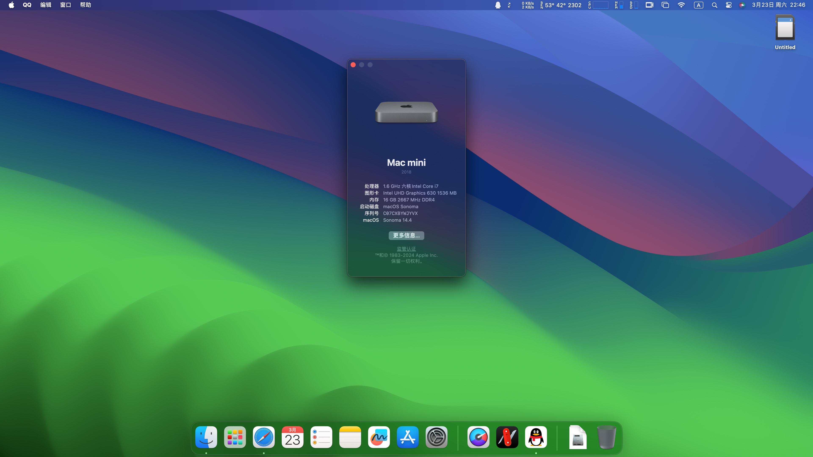
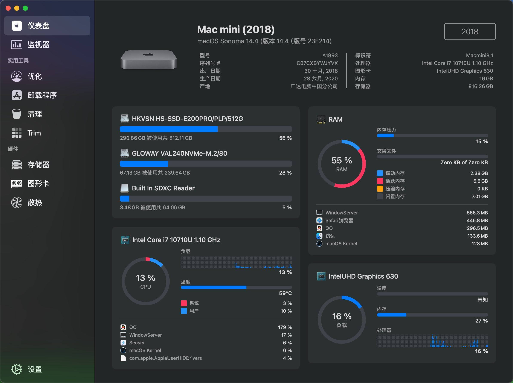
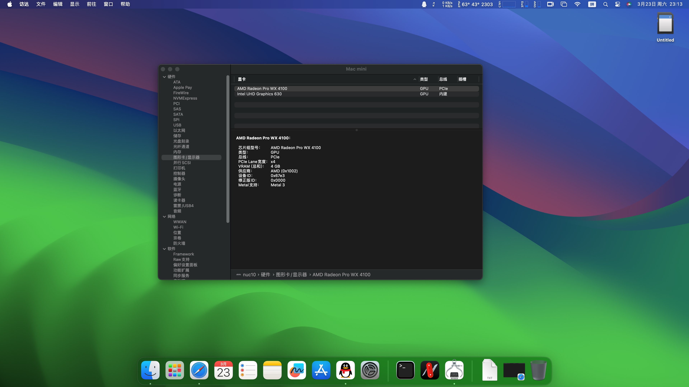
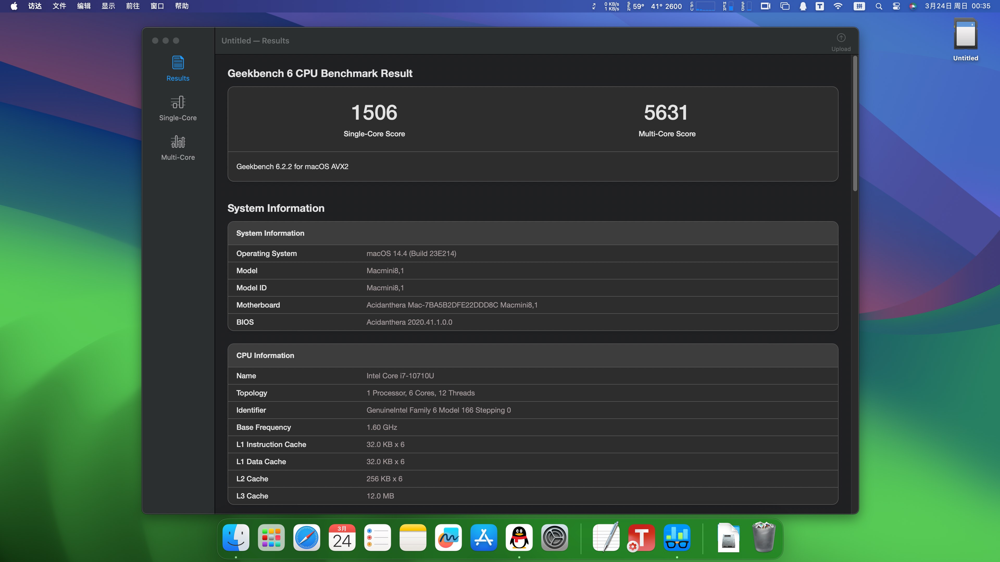

## Intel NUC10 黑苹果 OpenCore EFI

### [English](README.md)

### OpenCore

[OpenCore 1.0.0](https://github.com/acidanthera/OpenCorePkg)

### 适配机型

- NUC10i7FNH/FNK
- NUC10i5FNH/FNK
- NUC10i3FNH/FNK

### 可安装系统

- macOS Sonoma 14.x 
- macOS Ventura 13.x
- macOS Monterey 12.x
- macOS BigSur 11.x
- macOS Catalina 10.15.x

### BIOS 设置

**最新版本（0055以后）升级后会导致 `CFGLock.efi` 失效!!!** 

**怎样升级到最新版本 `0059`** 
1. 在0055版本上解锁 `CFGLock`, 保证 `CFG Lock` 值为 `0` 
2. 升级BIOS至最新版本 `0059` 
3. 进入 `CFGLock` , 查看 `CFG Lock` 值是否为 `0`, 为 `0` 则可以正常使用. 

BIOS version **FNCML357.0061(CFG Unlocked under 0055)**

+ Advanced
  - Storage
    * SATA Mode Selection -> AHCI
  - Video
    * IGD Minimum Memory -> 64MB
    * IGD Aperture Size -> 512MB
    * IGD Primary Video Port -> `Thunderbolt` 或 `HDMI` (根据自己的主显示器选择)
    * IGD Secondary Video Port -> None
+ Boot 
  - Secure Boot
    * Secure Boot -> Disabled
  - Boot Priority
    * UEFI Boot -> Checked
    * Legacy Boot -> Unchecked
    * Fast Boot -> Unchecked
+ Power
  - Secondary Power Settings
    * Deep S4/S5 -> On
    * Wake on Lan from S4/S5 -> Stay Off
    * Wake System from S5 -> Off
    * Wake From Thunderbolt Device -> Off

其它默认设置即可。

### CFG Unlock

新机器或之前未安装过 macOS 的机器，需要解锁CFGLock，具体步骤如下：

1. 找一个U盘，格式化为 `FAT32` 分区。
2. 下载 `EFI` 文件，解压放到U盘根目录。（注意：目录结构应为`/EFI`）。
3. 将U盘插入NUC，重启，按`F10`，选择从刚才放入 `EFI` 文件的那个U盘启动。 
4. 选择 `CFGLock Shell.efi` 选择回车，进行解锁。

注意：若在OC引导界面看不到 `CFGLock Shell.efi` ，按`空格键`即可显示。

**在 OC 引导界面，按 `空格键` 可显示辅助功能**

### 已知问题

- 雷电3设备不支持热插拔。
- Airdrop 无效。

### 系统截图

### Kexts

- [Lilu.kext](https://github.com/acidanthera/Lilu)
- [SMCProcessor.kext](https://github.com/acidanthera/VirtualSMC)
- [SMCSuperIO.kext](https://github.com/acidanthera/VirtualSMC)
- [VirtualSMC.kext](https://github.com/acidanthera/VirtualSMC)
- [WhateverGreen.kext](https://github.com/acidanthera/WhateverGreen)
- [AppleALC.kext](https://github.com/acidanthera/AppleALC)
- [IntelMausi.kext](https://github.com/acidanthera/IntelMausi)
- [AirportItlwm.kext](https://github.com/OpenIntelWireless/itlwm)
- [BlueToolFixup.kext](https://github.com/acidanthera/BrcmPatchRAM)
- [IntelBTPatcher.kext](https://github.com/OpenIntelWireless/IntelBluetoothFirmware)
- [IntelBluetoothFirmware.kext](https://github.com/OpenIntelWireless/IntelBluetoothFirmware)
- [IntelBluetoothInjector.kext](https://github.com/OpenIntelWireless/IntelBluetoothFirmware)

### 工具

- [Hackintool](https://github.com/headkaze/Hackintool) 
- [OCAuxiliaryTools](https://github.com/ic005k/OCAuxiliaryTools) 即 `OCAT`.
- [OpenCore Configurator](https://mackie100projects.altervista.org/opencore-configurator/) 即 `OCC`。
- [GenSMBIOS](https://github.com/corpnewt/GenSMBIOS) 三码生成工具。
- [MountEFI](https://github.com/corpnewt/MountEFI) EFI 分区挂载工具。
- [EFI Agent](https://github.com/headkaze/EFI-Agent) 更方便的EFI分区挂载工具。
- [gibMacOS](https://github.com/corpnewt/gibMacOS) macOS 官方镜像下载工具。
- [ProperTree](https://github.com/corpnewt/ProperTree) Plist 编辑器。

### 驱动

- [BIOS & 固件](https://www.asus.com.cn/supportonly/nuc10i7fnh/helpdesk_bios/) 

### OC 主题

[BsxM1](https://github.com/blackosx/BsxM1)

### 技术交流

QQ群: 591528332

### Credits

Thanks to [HawkysCC](https://github.com/HawkysCC) and his [EFI](https://github.com/HawkysCC/Hackintosh-NUC10i7)
